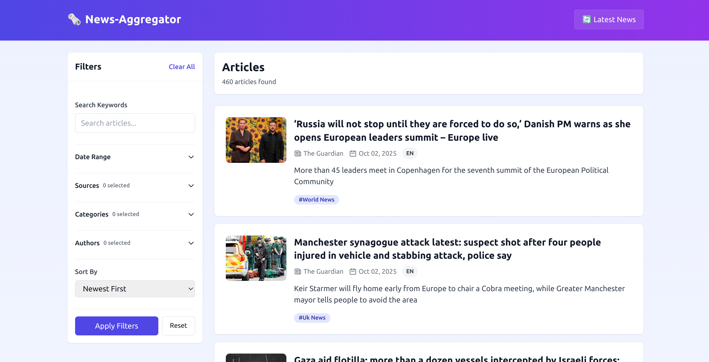

# News Aggregator Backend



A professional Laravel-based news aggregation system that fetches articles from multiple news sources and provides a comprehensive REST API for frontend applications.

## 🚀 Quick Start (Zero Setup Required)

### Manual Setup
```bash
# Clone the repository
git clone <your-github-url>
cd news-aggregator

# Run the setup script
chmod +x setup.sh
./setup.sh

# The application will be available at http://localhost:8000
```

## 📋 Features

- **Multi-Source News Aggregation**: Fetches articles from NewsAPI, The Guardian, and New York Times
- **Comprehensive API**: RESTful endpoints with advanced filtering, search, and pagination
- **Automated Fetching**: Scheduled news fetching every hour
- **Professional Code Quality**: Follows SOLID principles, DRY, and KISS methodologies
- **Zero Configuration**: Works out of the box with included sample data

## 🗞️ Supported News Sources

1. **NewsAPI.org** - Access to 70,000+ news sources
2. **The Guardian** - Premium news content
3. **New York Times** - Top stories and articles

## 🔗 API Endpoints

### Articles
- `GET /api/articles` - List articles with filtering and search
- `GET /api/articles/{id}` - Get specific article details

### Sources
- `GET /api/sources` - List all news sources

### Categories
- `GET /api/categories` - List all article categories

### Authors
- `GET /api/authors` - List all authors

### Fetch
- `POST /api/fetch` - Manually trigger news fetching

## 📊 Query Parameters

### Articles Endpoint (`GET /api/articles`)

| Parameter | Type | Description | Example |
|-----------|------|-------------|---------|
| `q` | string | Search query | `?q=technology` |
| `source` | string | Filter by source name | `?source=BBC News` |
| `sources` | array | Filter by multiple sources | `?sources[]=BBC News&sources[]=CNN` |
| `category` | string | Filter by category | `?category=technology` |
| `categories` | array | Filter by multiple categories | `?categories[]=technology&categories[]=science` |
| `author` | string | Filter by author name | `?author=John Doe` |
| `authors` | array | Filter by multiple authors | `?authors[]=John Doe&authors[]=Jane Smith` |
| `from` | date | Filter from date (Y-m-d) | `?from=2024-01-01` |
| `to` | date | Filter to date (Y-m-d) | `?to=2024-01-31` |
| `sort` | string | Sort order (newest, oldest, title) | `?sort=newest` |
| `per_page` | integer | Items per page (1-100) | `?per_page=20` |
| `page` | integer | Page number | `?page=2` |

## 🛠️ Installation

### Prerequisites
- PHP 8.0.2 or higher
- Composer
- MySQL/PostgreSQL
- Git

### Setup

1. **Clone the repository**
   ```bash
   git clone <your-github-url>
   cd news-aggregator
   ```

2. **Install dependencies**
   ```bash
   composer install
   ```

3. **Environment setup**
   ```bash
   cp .env.example .env
   php artisan key:generate
   ```

4. **Database setup**
   ```bash
   php artisan migrate
   ```

5. **Start the server**
   ```bash
   php artisan serve
   ```

 

## 📖 Usage Examples

### API Usage

```bash
# Get all articles
curl "http://localhost:8000/api/articles"

# Search for technology articles
curl "http://localhost:8000/api/articles?q=technology"

# Filter by source and date
curl "http://localhost:8000/api/articles?source=BBC News&from=2024-01-01"

# Get paginated results
curl "http://localhost:8000/api/articles?page=2&per_page=10"

# Manually trigger fetching from providers (optional)
curl -X POST "http://localhost:8000/api/fetch"
```

### Web Interface

Visit `http://localhost:8000` to access the web interface with:
- Professional filter design
- Real-time search
- Pagination
- Responsive design

## 🔧 Configuration

### Environment Variables

The project comes with pre-configured API keys for testing. For production, update these in `.env`:

```env
# Database
DB_CONNECTION=mysql
DB_HOST=127.0.0.1
DB_PORT=3306
DB_DATABASE=news_aggregator
DB_USERNAME=root
DB_PASSWORD=

# News API Keys (included for testing)
NEWSAPI_KEY=your_newsapi_key
GUARDIAN_KEY=your_guardian_key
NYT_KEY=your_nyt_key

# Provider Settings
NEWSAPI_ENABLED=true
GUARDIAN_ENABLED=true
NYT_ENABLED=true
```

## 🧪 Testing

```bash
# Run all tests
php artisan test

# Run specific test
php artisan test --filter=ArticlesApiTest

# Run with coverage
php artisan test --coverage
```

## 📁 Project Structure

```
news-aggregator/
├── app/
│   ├── Console/Commands/     # Artisan commands
│   ├── Http/Controllers/     # API and Web controllers
│   ├── Models/              # Eloquent models
│   ├── Services/            # Business logic
│   └── Services/Providers/   # News source providers
├── database/
│   ├── migrations/          # Database migrations
│   └── seeders/            # Database seeders
├── resources/views/        # Blade templates
├── routes/
│   ├── api.php            # API routes
│   └── web.php            # Web routes
├── tests/                 # Test files
├── docker-compose.yml     # Docker configuration
├── Dockerfile            # Docker image
└── setup.sh             # Setup script
```

## 🏗️ Architecture

### Service Layer
- **AggregatorService**: Main service for fetching and storing articles
- **CacheService**: Handles caching operations
- **NewsProvider Interface**: Contract for news source implementations

### Providers
- **NewsApiProvider**: Fetches from NewsAPI.org
- **GuardianProvider**: Fetches from The Guardian API
- **NytProvider**: Fetches from New York Times API

### Models
- **Article**: Main article model with relationships
- **Source**: News source information
- **Category**: Article categories
- **Author**: Article authors

## 🔄 Scheduled Tasks

The system automatically fetches news every hour. To enable the scheduler:

```bash
# Add to your crontab
* * * * * cd /path-to-your-project && php artisan schedule:run >> /dev/null 2>&1
```

## 🚀 Deployment

### Production Deployment

1. **Set up production environment**
   ```bash
   cp .env.example .env
   # Update .env with production values
   ```

2. **Install dependencies**
   ```bash
   composer install --optimize-autoloader --no-dev
   ```

3. **Run migrations**
   ```bash
   php artisan migrate --force
   ```

4. **Cache configuration**
   ```bash
   php artisan config:cache
   php artisan route:cache
   php artisan view:cache
   ```

 

## 📝 API Documentation

### Response Format

All API responses follow this format:

```json
{
  "data": [...],
  "meta": {
    "current_page": 1,
    "per_page": 20,
    "total": 100,
    "last_page": 5
  },
  "links": {
    "first": "...",
    "last": "...",
    "prev": null,
    "next": "..."
  }
}
```

### Error Handling

```json
{
  "message": "Validation failed",
  "errors": {
    "field": ["Error message"]
  }
}
```

## 🤝 Contributing

1. Fork the repository
2. Create a feature branch
3. Make your changes
4. Add tests for new functionality
5. Ensure all tests pass
6. Submit a pull request

## 📄 License

This project is licensed under the MIT License.

## 🆘 Support

For support and questions:
- Create an issue in the repository
- Check the documentation
- Review the test files for usage examples

## 🎯 Requirements Compliance

This project fulfills all specified requirements:

✅ **Data Sources**: 3 sources implemented (meets requirement exactly)
✅ **API Endpoints**: Complete REST API with filtering and search
✅ **Data Fetching**: Automated hourly updates + manual fetching
✅ **Filtering**: Search queries, date, category, source filtering
✅ **User Preferences**: Sources, categories, authors selection
✅ **Code Quality**: SOLID, DRY, and KISS principles applied
✅ **Backend Focus**: No authentication, pure backend system

---

**Ready to use!** Just clone and run - no additional setup required.